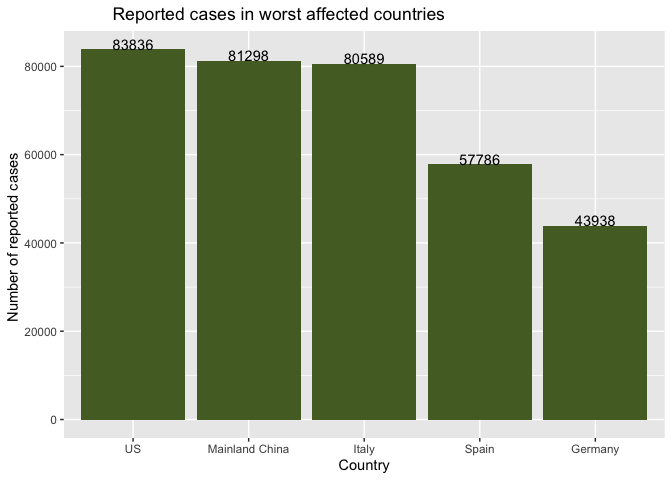
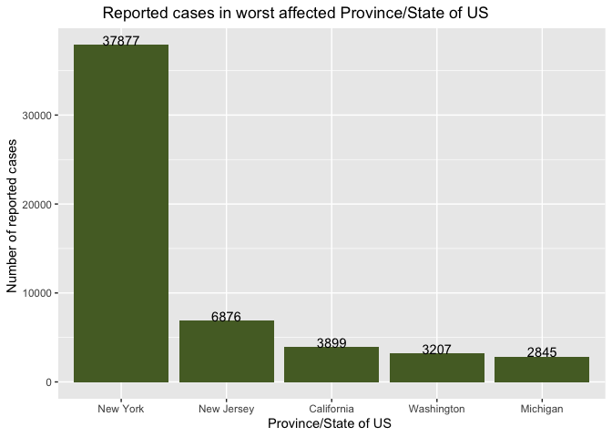
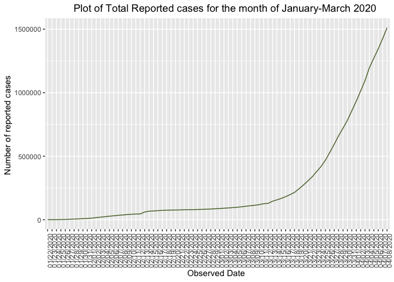
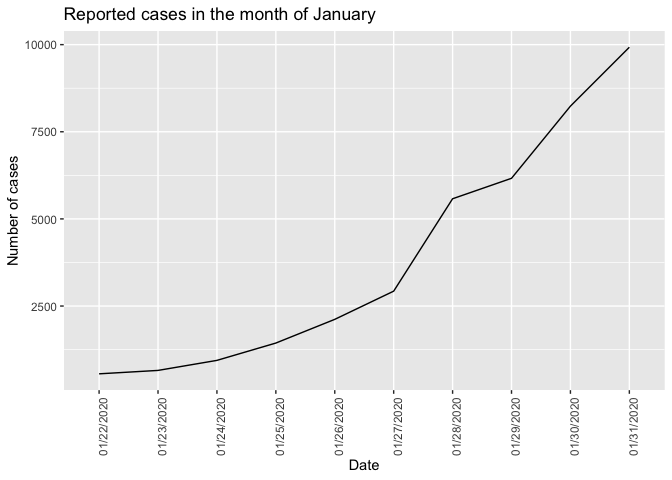
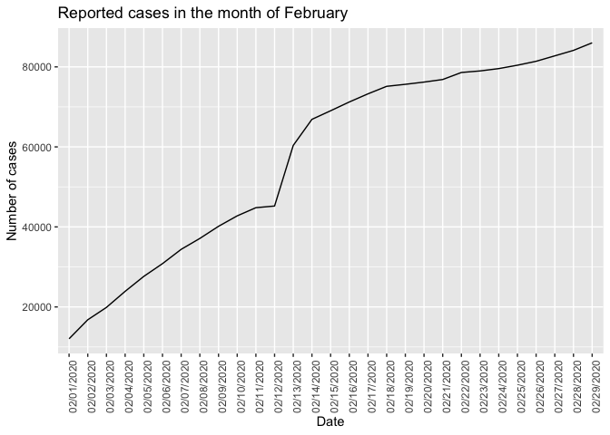
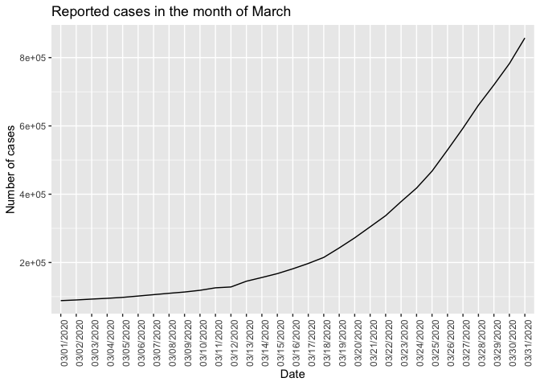

Covid-19 Analysis and Prediction
================
Arushi Sharma
3/14/2020

``` r
#Importing all required libraries

library(dplyr)
library(ggplot2)
library(tidyverse)
library(arsenal)
library(caret)
library(wordcloud)
```

``` r
#Importing dataset 

covid19 <- readr :: read_csv("novel-corona-virus-2019-dataset/covid_19_data.csv")
```

    ## Parsed with column specification:
    ## cols(
    ##   SNo = col_double(),
    ##   ObservationDate = col_character(),
    ##   `Province/State` = col_character(),
    ##   `Country/Region` = col_character(),
    ##   `Last Update` = col_character(),
    ##   Confirmed = col_double(),
    ##   Deaths = col_double(),
    ##   Recovered = col_double()
    ## )

``` r
head(covid19, 10)
```

    ## # A tibble: 10 x 8
    ##      SNo ObservationDate `Province/State` `Country/Region` `Last Update`
    ##    <dbl> <chr>           <chr>            <chr>            <chr>        
    ##  1     1 01/22/2020      Anhui            Mainland China   1/22/2020 17…
    ##  2     2 01/22/2020      Beijing          Mainland China   1/22/2020 17…
    ##  3     3 01/22/2020      Chongqing        Mainland China   1/22/2020 17…
    ##  4     4 01/22/2020      Fujian           Mainland China   1/22/2020 17…
    ##  5     5 01/22/2020      Gansu            Mainland China   1/22/2020 17…
    ##  6     6 01/22/2020      Guangdong        Mainland China   1/22/2020 17…
    ##  7     7 01/22/2020      Guangxi          Mainland China   1/22/2020 17…
    ##  8     8 01/22/2020      Guizhou          Mainland China   1/22/2020 17…
    ##  9     9 01/22/2020      Hainan           Mainland China   1/22/2020 17…
    ## 10    10 01/22/2020      Hebei            Mainland China   1/22/2020 17…
    ## # … with 3 more variables: Confirmed <dbl>, Deaths <dbl>, Recovered <dbl>

``` r
tail(covid19, 10)
```

    ## # A tibble: 10 x 8
    ##      SNo ObservationDate `Province/State` `Country/Region` `Last Update`
    ##    <dbl> <chr>           <chr>            <chr>            <chr>        
    ##  1 13200 04/08/2020      Virginia         US               2020-04-08 2…
    ##  2 13201 04/08/2020      Washington       US               2020-04-08 2…
    ##  3 13202 04/08/2020      West Virginia    US               2020-04-08 2…
    ##  4 13203 04/08/2020      Western Austral… Australia        2020-04-08 2…
    ##  5 13204 04/08/2020      Wisconsin        US               2020-04-08 2…
    ##  6 13205 04/08/2020      Wyoming          US               2020-04-08 2…
    ##  7 13206 04/08/2020      Xinjiang         Mainland China   2020-04-08 2…
    ##  8 13207 04/08/2020      Yukon            Canada           2020-04-08 2…
    ##  9 13208 04/08/2020      Yunnan           Mainland China   2020-04-08 2…
    ## 10 13209 04/08/2020      Zhejiang         Mainland China   2020-04-08 2…
    ## # … with 3 more variables: Confirmed <dbl>, Deaths <dbl>, Recovered <dbl>

``` r
#summary of the data
summary(covid19)
```

    ##       SNo        ObservationDate    Province/State     Country/Region    
    ##  Min.   :    1   Length:13209       Length:13209       Length:13209      
    ##  1st Qu.: 3303   Class :character   Class :character   Class :character  
    ##  Median : 6605   Mode  :character   Mode  :character   Mode  :character  
    ##  Mean   : 6605                                                           
    ##  3rd Qu.: 9907                                                           
    ##  Max.   :13209                                                           
    ##  Last Update          Confirmed          Deaths           Recovered      
    ##  Length:13209       Min.   :     0   Min.   :    0.00   Min.   :    0.0  
    ##  Class :character   1st Qu.:     5   1st Qu.:    0.00   1st Qu.:    0.0  
    ##  Mode  :character   Median :    51   Median :    0.00   Median :    1.0  
    ##                     Mean   :  1544   Mean   :   73.53   Mean   :  388.4  
    ##                     3rd Qu.:   345   3rd Qu.:    3.00   3rd Qu.:   24.0  
    ##                     Max.   :151061   Max.   :17669.00   Max.   :64142.0

``` r
#Finding deaths by country

covid19 %>% distinct(`Country/Region`) %>% count()
```

    ## # A tibble: 1 x 1
    ##       n
    ##   <int>
    ## 1   218

``` r
#%>% filter(Deaths > 0) %>% count(Deaths)
```

``` r
tot <- covid19 %>%
  filter(ObservationDate == "03/26/2020") %>%
  group_by(`Country/Region`) %>%
  summarise(sm= sum(Confirmed)) %>%
  summarise(sm= sum(sm)) 

filtered <- covid19 %>% filter(ObservationDate == "03/26/2020") %>% 
  group_by(`Country/Region`) %>% 
  summarise(n=sum(Confirmed)) %>% 
  arrange((n)) %>%
  tail(5)

  ggplot(filtered) + aes(x=reorder(`Country/Region`,-n),n) + 
    geom_col() +
    geom_col(stat = "identity",fill = "darkolivegreen") +  
    labs(title = "          Reported cases in worst affected countries    ") +
    xlab("Country") +
    ylab("Number of reported cases ")  +
    geom_text(aes(label=n), vjust=.001, color = "black")
```

<!-- -->

``` r
(covid19 %>% filter(ObservationDate == "03/26/2020") %>% 
   filter(`Country/Region` == "US") %>% summarise(sum(Confirmed)) )/tot
```

    ##   sum(Confirmed)
    ## 1      0.1583033

``` r
covid19 %>% filter(`Country/Region` == "US") %>%
  filter(ObservationDate == "03/26/2020") %>%
  group_by(`Province/State`) %>% 
  summarise(n=sum(Confirmed)) %>% 
  arrange((n)) %>% tail(5) %>% 
  ggplot() + aes(x=reorder(`Province/State`,-n),n) + 
  geom_col() +geom_col(stat = "identity",fill = "darkolivegreen") +  
  labs(title = "          Reported cases in worst affected Province/State of US    ") +
  xlab("Province/State of US ") +ylab("Number of reported cases ")  +
  geom_text(aes(label=n), vjust=.001, color = "black")
```

    ## Warning: Ignoring unknown parameters: stat

<!-- -->

``` r
covid_cases <- covid19 %>% filter(ObservationDate == "03/26/2020") %>% 
  group_by(`Country/Region`) %>% 
  summarise(confirmed_cases=sum(Confirmed),Casualities=sum(Deaths),Recovered_cases=sum(Recovered)) %>%
  arrange(desc(confirmed_cases)) %>% head(5)
covid_cases
```

    ## # A tibble: 5 x 4
    ##   `Country/Region` confirmed_cases Casualities Recovered_cases
    ##   <chr>                      <dbl>       <dbl>           <dbl>
    ## 1 US                         83836        1209             681
    ## 2 Mainland China             81298        3287           74061
    ## 3 Italy                      80589        8215           10361
    ## 4 Spain                      57786        4365            7015
    ## 5 Germany                    43938         267            5673

``` r
#calculating the recovery rate

covid_cases <- covid_cases %>% mutate(recovered_ratio = Recovered_cases/confirmed_cases)
covid_cases
```

    ## # A tibble: 5 x 5
    ##   `Country/Region` confirmed_cases Casualities Recovered_cases recovered_ratio
    ##   <chr>                      <dbl>       <dbl>           <dbl>           <dbl>
    ## 1 US                         83836        1209             681         0.00812
    ## 2 Mainland China             81298        3287           74061         0.911  
    ## 3 Italy                      80589        8215           10361         0.129  
    ## 4 Spain                      57786        4365            7015         0.121  
    ## 5 Germany                    43938         267            5673         0.129

``` r
covid_mean <- covid19 %>% filter(ObservationDate == "03/26/2020") %>% 
  summarise(confirmed_cases=sum(Confirmed),Casuality=sum(Deaths),Recovered_cases=sum(Recovered)) %>%
  arrange(desc(confirmed_cases))
covid_mean
```

    ## # A tibble: 1 x 3
    ##   confirmed_cases Casuality Recovered_cases
    ##             <dbl>     <dbl>           <dbl>
    ## 1          529591     23970          122150

``` r
covid19 %>% group_by(ObservationDate) %>% 
  summarise(datewise = sum(Confirmed)) %>% 
  ggplot(aes(x=ObservationDate, y=datewise, group=1)) +
  geom_line(col="darkolivegreen") + theme(axis.text.x = element_text(angle = 90, hjust = 1)) +
  labs(title = "          Plot of Total Reported cases for the month of January-March 2020   ") +
  xlab("Observed Date ") +ylab("Number of reported cases ")  
```

<!-- -->

``` r
covid19 %>% filter(grepl('^01/', ObservationDate)) %>% group_by(ObservationDate) %>% 
  summarise(datewise = sum(Confirmed)) %>% 
  ggplot(aes(x=ObservationDate, y=datewise, group=1)) +
  geom_line(col = "black") +labs(title="Reported cases in the month of January",x="Date", y = "Number of cases") +
  theme(axis.text.x = element_text(angle = 90, hjust = 1)) 
```

<!-- -->

``` r
covid19 %>% filter(grepl('^02/', ObservationDate)) %>% group_by(ObservationDate) %>% 
  summarise(datewise = sum(Confirmed)) %>% 
  ggplot(aes(x=ObservationDate, y=datewise, group=1)) +
  geom_line(col = "black") +labs(title="Reported cases in the month of February",x="Date", y = "Number of cases") +
  theme(axis.text.x = element_text(angle = 90, hjust = 1)) 
```

<!-- -->

``` r
covid19 %>% filter(grepl('^03/', ObservationDate)) %>% group_by(ObservationDate) %>% 
  summarise(datewise = sum(Confirmed)) %>% 
  ggplot(aes(x=ObservationDate, y=datewise, group=1)) +
  geom_line(col = "black") +labs(title="Reported cases in the month of March",x="Date", y = "Number of cases") +
  theme(axis.text.x = element_text(angle = 90, hjust = 1)) 
```

<!-- -->

``` r
covid_cloud <- covid19 %>% 
  filter(ObservationDate == "03/26/2020" )

wordcloud(covid_cloud$`Province/State`,covid_cloud$Confirmed,random.order = FALSE,rot.per = .3,
          scale = c(5,.8),max.words = 100,colors = brewer.pal(7,"Set1"))
```

<!-- -->

``` r
 covid_cloud %>% filter(ObservationDate == "03/26/2020") %>% 
  group_by(`Country/Region`) %>% 
  summarise(confirmed_cases=sum(Confirmed),Casulty=sum(Deaths),Recovered_cases=sum(Recovered)) %>%
  arrange(desc(confirmed_cases)) %>% head(5)
```

    ## # A tibble: 5 x 4
    ##   `Country/Region` confirmed_cases Casulty Recovered_cases
    ##   <chr>                      <dbl>   <dbl>           <dbl>
    ## 1 US                         83836    1209             681
    ## 2 Mainland China             81298    3287           74061
    ## 3 Italy                      80589    8215           10361
    ## 4 Spain                      57786    4365            7015
    ## 5 Germany                    43938     267            5673
