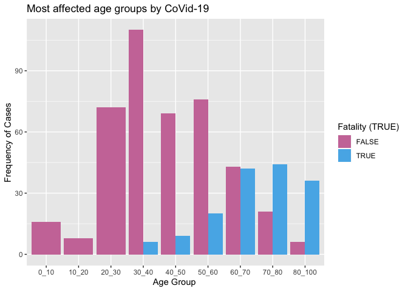
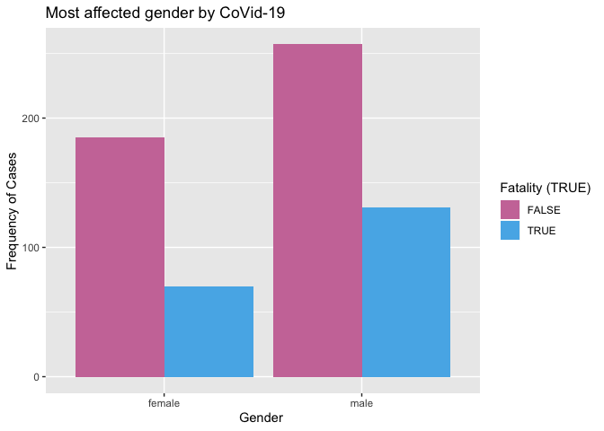
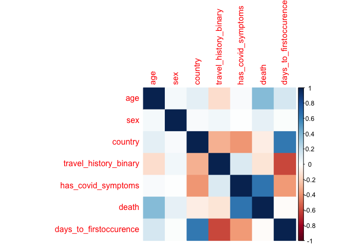
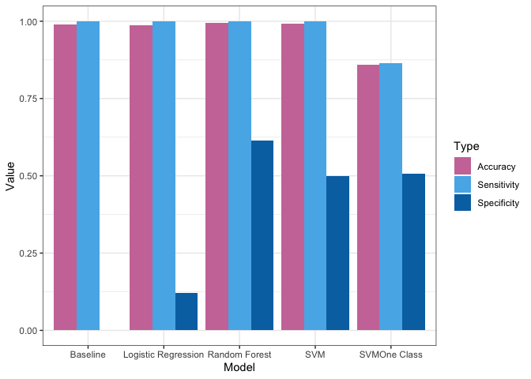
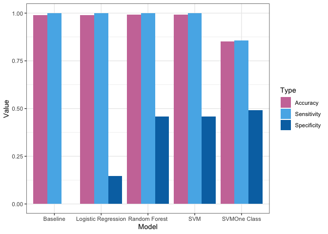
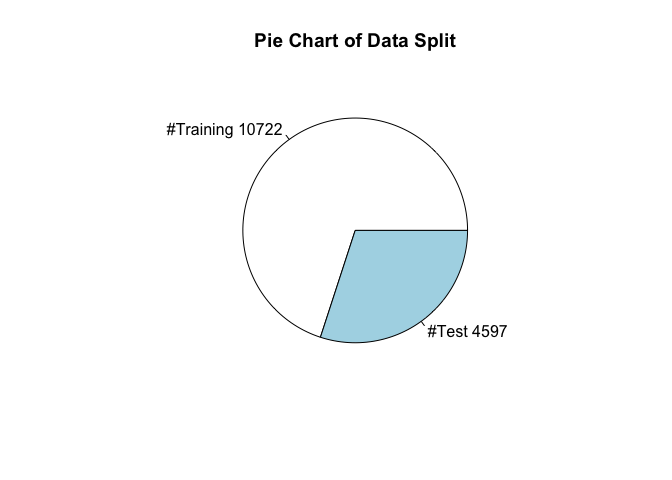
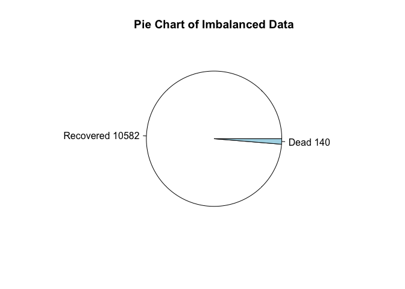
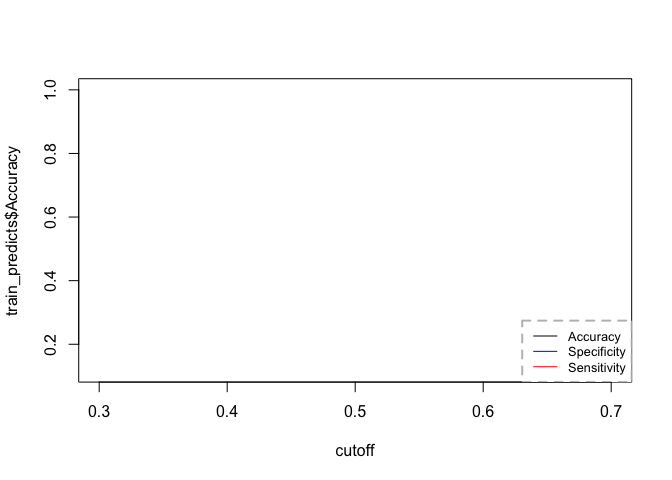
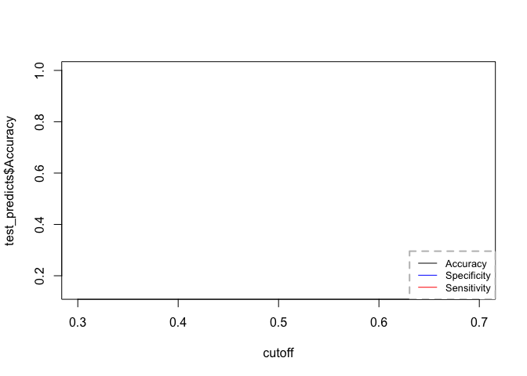

EDA\_openList
================
Arushi Sharma
4/10/2020

``` r
#Importing all required libraries

library(dplyr)
library(ggplot2)
library(tidyverse)
library(chron)
library(lubridate)
library(caTools)
library(caret)
library(rsample)
library(ROCR)
library(e1071)
library(corrplot)
library(polycor)
library(corrgram)
library(randomForest)
```

``` r
open_line <-  readr::read_csv("latestdata_10Apr.csv")
```

    ## Parsed with column specification:
    ## cols(
    ##   .default = col_character(),
    ##   latitude = col_double(),
    ##   longitude = col_double(),
    ##   chronic_disease = col_logical(),
    ##   admin_id = col_double(),
    ##   data_moderator_initials = col_logical(),
    ##   travel_history_binary = col_logical()
    ## )

    ## See spec(...) for full column specifications.

    ## Warning: 37850 parsing failures.
    ##  row             col           expected                 actual                   file
    ## 1580 chronic_disease 1/0/T/F/TRUE/FALSE HIV positive           'latestdata_10Apr.csv'
    ## 1608 chronic_disease 1/0/T/F/TRUE/FALSE hepatitis B, diabetes  'latestdata_10Apr.csv'
    ## 2543 chronic_disease 1/0/T/F/TRUE/FALSE hypertension; diabetes 'latestdata_10Apr.csv'
    ## 4200 chronic_disease 1/0/T/F/TRUE/FALSE diabetes, hypertension 'latestdata_10Apr.csv'
    ## 5585 chronic_disease 1/0/T/F/TRUE/FALSE diabetes               'latestdata_10Apr.csv'
    ## .... ............... .................. ...................... ......................
    ## See problems(...) for more details.

``` r
open_line
```

    ## # A tibble: 266,874 x 33
    ##    ID    age   sex   city  province country latitude longitude geo_resolution
    ##    <chr> <chr> <chr> <chr> <chr>    <chr>      <dbl>     <dbl> <chr>         
    ##  1 000-… 30    male  Chao… Anhui    China       31.6    118.   admin3        
    ##  2 000-… 60-69 fema… What… Washing… United…     48.8   -122.   admin2        
    ##  3 000-… 30    male  Hefe… Anhui    China       31.8    117.   admin2        
    ##  4 000-… 60-69 fema… Pitk… Colorado United…     39.2   -107.   admin2        
    ##  5 000-… 44    male  <NA>  Zurich   Switze…     47.4      8.66 admin1        
    ##  6 000-… 65    fema… Shen… Guangdo… China       22.7    114.   admin2        
    ##  7 000-… <NA>  <NA>  Nant… Jiangsu  China       32.2    121.   admin2        
    ##  8 000-… <NA>  <NA>  <NA>  Hamburg  Germany     53.5     10.0  admin1        
    ##  9 000-… 8-68  <NA>  Xuzh… Jiangsu  China       34.4    118.   admin2        
    ## 10 000-… 8-68  <NA>  Chan… Jiangsu  China       31.6    120.   admin2        
    ## # … with 266,864 more rows, and 24 more variables: date_onset_symptoms <chr>,
    ## #   date_admission_hospital <chr>, date_confirmation <chr>, symptoms <chr>,
    ## #   lives_in_Wuhan <chr>, travel_history_dates <chr>,
    ## #   travel_history_location <chr>, reported_market_exposure <chr>,
    ## #   additional_information <chr>, chronic_disease_binary <chr>,
    ## #   chronic_disease <lgl>, source <chr>, sequence_available <chr>,
    ## #   outcome <chr>, date_death_or_discharge <chr>, notes_for_discussion <chr>,
    ## #   location <chr>, admin3 <chr>, admin2 <chr>, admin1 <chr>,
    ## #   country_new <chr>, admin_id <dbl>, data_moderator_initials <lgl>,
    ## #   travel_history_binary <lgl>

``` r
# Filtering and cleaning data
covid19 <- open_line %>% select(age, sex, country, date_confirmation, symptoms,
                                outcome, travel_history_binary)

summary(covid19)
```

    ##      age                sex              country          date_confirmation 
    ##  Length:266874      Length:266874      Length:266874      Length:266874     
    ##  Class :character   Class :character   Class :character   Class :character  
    ##  Mode  :character   Mode  :character   Mode  :character   Mode  :character  
    ##                                                                             
    ##    symptoms           outcome          travel_history_binary
    ##  Length:266874      Length:266874      Mode :logical        
    ##  Class :character   Class :character   FALSE:20580          
    ##  Mode  :character   Mode  :character   TRUE :1942           
    ##                                        NA's :244352

``` r
# Converting age to integer values
covid19$age <- as.integer(covid19$age)
```

    ## Warning: NAs introduced by coercion

``` r
# Converting age into groups
recode_age <- function(x) {
  y <- character(length(x))
  y[x < 10] <- "0_10"
  y[x >= 10] <- "10_20" 
  y[x >= 20] <- "20_30" 
  y[x >= 30] <- "30_40"
  y[x >= 40] <- "40_50" 
  y[x >= 50] <- "50_60" 
  y[x >= 60] <- "60_70" 
  y[x >= 70] <- "70_80" 
  y[x >= 80] <- "80_100"
  y
}
covid19 <- covid19 %>% mutate(age_group = recode_age(age))
covid19 <- mutate(covid19, age_group = factor(age_group,level =c("0_10","10_20","20_30", "30_40","40_50","50_60", "60_70","70_80", "80_100")))


#converting symptoms into categorical variable
covid19$has_covid_symptoms<- str_detect(tolower(covid19$symptoms), 'fever|cough|breath|breathing|throat|pneumonia|respiratory|heart|chest|lung|weak|tired|tiring|fatigue|chill')

#Creating a new column for death
covid19$death <- str_detect(tolower(covid19$outcome), 'death|died|dead|deceased')

#Changing sex column to lowercase
covid19$sex <- tolower(covid19$sex)

#Changing country column to lowercase
covid19$country <- tolower(covid19$country)


#Formatting the date 
covid19$confirmation_date <- (as.Date(covid19$date_confirmation, "%d.%m.%Y"))

#Creating a new column as no of days for each patient by country
covid19$minimum_date <- covid19$confirmation_date
unique_countries <- unique(covid19$country) 

for (ucountry in unique_countries){
  new_date <- covid19 %>% filter(covid19$country == ucountry) %>%
    summarise(min(confirmation_date, na.rm = TRUE))
    earliest_date <- do.call("c", new_date)
    index <- covid19$country == ucountry
    covid19$minimum_date[index] <- earliest_date
}
```

    ## Warning in min.default(structure(c(NA_real_, NA_real_), class = "Date"), : no
    ## non-missing arguments to min; returning Inf

    ## Warning in min.default(structure(c(NA_real_, NA_real_), class = "Date"), : no
    ## non-missing arguments to min; returning Inf

    ## Warning in min.default(structure(numeric(0), class = "Date"), na.rm = TRUE): no
    ## non-missing arguments to min; returning Inf

``` r
covid19$days_to_firstoccurence <- as.numeric(as.Date(as.character(covid19$confirmation_date), format="%Y-%m-%d")-
                  as.Date(as.character(covid19$minimum_date), format="%Y-%m-%d"))
```

``` r
covid <- covid19 %>% select(age, sex, country, travel_history_binary, age_group, has_covid_symptoms,
                            death, confirmation_date, minimum_date, days_to_firstoccurence)

colnames(covid)
```

    ##  [1] "age"                    "sex"                    "country"               
    ##  [4] "travel_history_binary"  "age_group"              "has_covid_symptoms"    
    ##  [7] "death"                  "confirmation_date"      "minimum_date"          
    ## [10] "days_to_firstoccurence"

``` r
summary(covid)
```

    ##       age             sex              country          travel_history_binary
    ##  Min.   :  0.00   Length:266874      Length:266874      Mode :logical        
    ##  1st Qu.: 33.00   Class :character   Class :character   FALSE:20580          
    ##  Median : 47.00   Mode  :character   Mode  :character   TRUE :1942           
    ##  Mean   : 47.77                                         NA's :244352         
    ##  3rd Qu.: 61.00                                                              
    ##  Max.   :121.00                                                              
    ##  NA's   :254912                                                              
    ##    age_group      has_covid_symptoms   death         confirmation_date   
    ##  50_60  :  2201   Mode :logical      Mode :logical   Min.   :2020-01-06  
    ##  30_40  :  2200   FALSE:420          FALSE:789       1st Qu.:2020-03-10  
    ##  40_50  :  2139   TRUE :1323         TRUE :216       Median :2020-03-22  
    ##  60_70  :  1818   NA's :265131       NA's :265869    Mean   :2020-03-13  
    ##  20_30  :  1684                                      3rd Qu.:2020-03-25  
    ##  (Other):  1920                                      Max.   :2020-04-08  
    ##  NA's   :254912                                      NA's   :1543        
    ##   minimum_date        days_to_firstoccurence
    ##  Min.   :2020-01-06   Min.   : 0.00         
    ##  1st Qu.:2020-01-20   1st Qu.:28.00         
    ##  Median :2020-01-20   Median :54.00         
    ##  Mean   :NA           Mean   :46.83         
    ##  3rd Qu.:2020-01-31   3rd Qu.:63.00         
    ##  Max.   :NA           Max.   :69.00         
    ##  NA's   :23           NA's   :1543

``` r
# Plotting Age vs Death ratio

age_death <- covid %>% select(age_group, death)
clean_age_death <- na.omit(age_death)

ggplot(clean_age_death, mapping = aes(x = age_group, fill= as.factor(death))) +
geom_bar(position = "dodge") +
            xlab("Age Group ") +
            ylab("Frequency of Cases") +
            ggtitle("Most affected age groups by CoVid-19")+
   scale_fill_manual(values=c("#CC79A7","#56B4E9"))+
  guides(fill=guide_legend(title="Fatality (TRUE)"))
```

<!-- -->

``` r
#Most affected gender by corona

gender_death <- covid %>% select(sex, death)
clean_gender_death <- na.omit(gender_death)

ggplot(clean_gender_death, mapping = aes(x = sex, fill= as.factor(death))) +
geom_bar(position = "dodge") +
            xlab("Gender ") +
            ylab("Frequency of Cases") +
            ggtitle("Most affected gender by CoVid-19")+
  scale_fill_manual(values=c("#CC79A7","#56B4E9"))+
  guides(fill=guide_legend(title="Fatality (TRUE)"))
```

<!-- -->

``` r
#Selecting the final set of variables
covid_model <- covid %>% select(age, sex, country, travel_history_binary, has_covid_symptoms,
                            death, days_to_firstoccurence)

summary(covid_model)
```

    ##       age             sex              country          travel_history_binary
    ##  Min.   :  0.00   Length:266874      Length:266874      Mode :logical        
    ##  1st Qu.: 33.00   Class :character   Class :character   FALSE:20580          
    ##  Median : 47.00   Mode  :character   Mode  :character   TRUE :1942           
    ##  Mean   : 47.77                                         NA's :244352         
    ##  3rd Qu.: 61.00                                                              
    ##  Max.   :121.00                                                              
    ##  NA's   :254912                                                              
    ##  has_covid_symptoms   death         days_to_firstoccurence
    ##  Mode :logical      Mode :logical   Min.   : 0.00         
    ##  FALSE:420          FALSE:789       1st Qu.:28.00         
    ##  TRUE :1323         TRUE :216       Median :54.00         
    ##  NA's :265131       NA's :265869    Mean   :46.83         
    ##                                     3rd Qu.:63.00         
    ##                                     Max.   :69.00         
    ##                                     NA's   :1543

``` r
sum(!apply(covid_model, 1, anyNA))
```

    ## [1] 101

``` r
#Handling NA values of columns

#changing all NAs of travel_history_binary to FALSE
covid_model$travel_history_binary[is.na(covid_model$travel_history_binary)] <- FALSE
covid_model$death[is.na(covid_model$death)] <- FALSE
covid_model$has_covid_symptoms[is.na(covid_model$has_covid_symptoms)] <- FALSE
covid_model$country[is.na(covid_model$country)] <- 'other'

covid_model$days_to_firstoccurence[is.na(covid_model$days_to_firstoccurence)] <- mean(covid_model$days_to_firstoccurence, na.rm = TRUE)


covid_model$age[is.na(covid_model$age)] <- mean(covid_model$age, na.rm = TRUE)

summary(covid_model)
```

    ##       age             sex              country          travel_history_binary
    ##  Min.   :  0.00   Length:266874      Length:266874      Mode :logical        
    ##  1st Qu.: 47.77   Class :character   Class :character   FALSE:264932         
    ##  Median : 47.77   Mode  :character   Mode  :character   TRUE :1942           
    ##  Mean   : 47.77                                                              
    ##  3rd Qu.: 47.77                                                              
    ##  Max.   :121.00                                                              
    ##  has_covid_symptoms   death         days_to_firstoccurence
    ##  Mode :logical      Mode :logical   Min.   : 0.00         
    ##  FALSE:265551       FALSE:266658    1st Qu.:28.00         
    ##  TRUE :1323         TRUE :216       Median :54.00         
    ##                                     Mean   :46.83         
    ##                                     3rd Qu.:63.00         
    ##                                     Max.   :69.00

``` r
sum(!apply(covid_model, 1, anyNA))
```

    ## [1] 15319

``` r
covid_model <- na.omit(covid_model)
str(covid_model)
```

    ## tibble [15,319 × 7] (S3: tbl_df/tbl/data.frame)
    ##  $ age                   : num [1:15319] 30 47.8 30 47.8 44 ...
    ##  $ sex                   : chr [1:15319] "male" "female" "male" "female" ...
    ##  $ country               : chr [1:15319] "china" "united states" "china" "united states" ...
    ##  $ travel_history_binary : logi [1:15319] FALSE FALSE FALSE FALSE FALSE FALSE ...
    ##  $ has_covid_symptoms    : logi [1:15319] FALSE FALSE FALSE FALSE FALSE TRUE ...
    ##  $ death                 : logi [1:15319] FALSE FALSE FALSE FALSE FALSE FALSE ...
    ##  $ days_to_firstoccurence: num [1:15319] 4 50 5 51 34 3 8 8 34 3 ...
    ##  - attr(*, "na.action")= 'omit' Named int [1:251555] 7 8 9 10 11 12 13 14 15 16 ...
    ##   ..- attr(*, "names")= chr [1:251555] "7" "8" "9" "10" ...

# Corelation Matrix

``` r
#M <- cor(covid_model)
covid_cor <- covid_model %>% select(age, sex, country, travel_history_binary, has_covid_symptoms,
                            death, days_to_firstoccurence)
#corrplot(M, method = "circle")
cordata <- hetcor(covid_cor, use = "complete.obs")
```

    ## data contain one or more character variables
    ## the values of which are ordered alphabetically

``` r
corrplot(cordata$correlations, method="color", na.label = "square", na.label.col = "lightblue")
```

<!-- -->

``` r
#sort(unique(covid_cor$country))
```

# Factoring all the columns to be used for modeling

``` r
covid_model <- covid_model %>%
mutate(
    sex = factor(sex),
    country = factor(country),
    has_covid_symptoms = factor(has_covid_symptoms, label = c(0, 1)),
    death = factor(death, label = c(0, 1)),
    travel_history_binary = factor(travel_history_binary, label = c(0, 1)),
    )

summary(covid_model)
```

    ##       age             sex                country     travel_history_binary
    ##  Min.   :  0.00   female:6674   united states:5541   0:13518              
    ##  1st Qu.: 38.00   male  :8645   mexico       :2079   1: 1801              
    ##  Median : 47.77                 china        :1586                        
    ##  Mean   : 47.84                 philippines  :1512                        
    ##  3rd Qu.: 56.00                 japan        : 662                        
    ##  Max.   :121.00                 brazil       : 538                        
    ##                                 (Other)      :3401                        
    ##  has_covid_symptoms death     days_to_firstoccurence
    ##  0:14033            0:15118   Min.   : 0.00         
    ##  1: 1286            1:  201   1st Qu.:26.00         
    ##                               Median :46.83         
    ##                               Mean   :41.55         
    ##                               3rd Qu.:58.00         
    ##                               Max.   :68.00         
    ## 

``` r
str(covid_model)
```

    ## tibble [15,319 × 7] (S3: tbl_df/tbl/data.frame)
    ##  $ age                   : num [1:15319] 30 47.8 30 47.8 44 ...
    ##  $ sex                   : Factor w/ 2 levels "female","male": 2 1 2 1 2 1 1 1 2 2 ...
    ##  $ country               : Factor w/ 98 levels "afghanistan",..: 19 95 19 95 89 19 19 19 89 19 ...
    ##  $ travel_history_binary : Factor w/ 2 levels "0","1": 1 1 1 1 1 1 1 1 1 1 ...
    ##  $ has_covid_symptoms    : Factor w/ 2 levels "0","1": 1 1 1 1 1 2 1 1 1 2 ...
    ##  $ death                 : Factor w/ 2 levels "0","1": 1 1 1 1 1 1 1 1 1 1 ...
    ##  $ days_to_firstoccurence: num [1:15319] 4 50 5 51 34 3 8 8 34 3 ...

# Splitting into Training and Testing dataset

``` r
# Create Training Data

set.seed(100)  # for repeatability of samples

input_ones <- covid_model[which(covid_model$death == 1), ]  # all 1's
input_zeros <- covid_model[which(covid_model$death == 0), ]  # all 0's

input_ones_training_rows <- sample(1:nrow(input_ones), 0.7*nrow(input_ones))  # 1's for training
input_zeros_training_rows <- sample(1:nrow(input_zeros), 0.7*nrow(input_zeros))  # 0's for training. Pick as many 0's as 1's

training_ones <- input_ones[input_ones_training_rows, ]  
training_zeros <- input_zeros[input_zeros_training_rows, ]
trainingData <- rbind(training_ones, training_zeros)  # row bind the 1's and 0's 

# Create Test Data
test_ones <- input_ones[-input_ones_training_rows, ]
test_zeros <- input_zeros[-input_zeros_training_rows, ]
testData <- rbind(test_ones, test_zeros)  # row bind the 1's and 0's 

summary(trainingData)
```

    ##       age             sex                country     travel_history_binary
    ##  Min.   :  0.00   female:4736   united states:3907   0:9490               
    ##  1st Qu.: 38.00   male  :5986   mexico       :1473   1:1232               
    ##  Median : 47.77                 china        :1097                        
    ##  Mean   : 47.93                 philippines  :1068                        
    ##  3rd Qu.: 57.00                 japan        : 462                        
    ##  Max.   :121.00                 brazil       : 378                        
    ##                                 (Other)      :2337                        
    ##  has_covid_symptoms death     days_to_firstoccurence
    ##  0:9825             0:10582   Min.   : 0.00         
    ##  1: 897             1:  140   1st Qu.:26.00         
    ##                               Median :46.83         
    ##                               Mean   :41.66         
    ##                               3rd Qu.:58.00         
    ##                               Max.   :68.00         
    ## 

``` r
summary(testData)
```

    ##       age            sex                country     travel_history_binary
    ##  Min.   : 0.00   female:1938   united states:1634   0:4028               
    ##  1st Qu.:38.00   male  :2659   mexico       : 606   1: 569               
    ##  Median :47.77                 china        : 489                        
    ##  Mean   :47.65                 philippines  : 444                        
    ##  3rd Qu.:56.00                 japan        : 200                        
    ##  Max.   :97.00                 australia    : 169                        
    ##                                (Other)      :1055                        
    ##  has_covid_symptoms death    days_to_firstoccurence
    ##  0:4208             0:4536   Min.   : 0.00         
    ##  1: 389             1:  61   1st Qu.:26.00         
    ##                              Median :46.83         
    ##                              Mean   :41.32         
    ##                              3rd Qu.:58.00         
    ##                              Max.   :68.00         
    ## 

# Modelling

``` r
#classifier_types : glm, svm, rf(random forest), svm_oneclass
classifier_type <- "glm"
if (classifier_type=="glm"){
  classifier <- glm(death ~ age+sex+has_covid_symptoms+days_to_firstoccurence,
                data=trainingData, family=binomial(link="logit"))
}

if (classifier_type=="svm"){
  classifier = svm(formula = death ~age+sex+has_covid_symptoms+days_to_firstoccurence,
                 data = predicted_trainData, 
                 type = 'C-classification', kernel = 'radial', gamma=0.25 , nu=0.5) 
}

if (classifier_type=="rf"){
  classifier = randomForest(death ~ age+sex+has_covid_symptoms+days_to_firstoccurence, data = predicted_trainData, importance = TRUE)
}


if (classifier_type=="svm_oneclass"){
  classifier = svm(formula = death ~ age+sex+has_covid_symptoms+days_to_firstoccurence,
                 data = predicted_trainData[predicted_trainData$death == 1,], 
                 type = 'one-classification', kernel = 'radial', gamma=0.25 , nu=0.5 ) 
}


summary(classifier)
```

    ## 
    ## Call:
    ## glm(formula = death ~ age + sex + has_covid_symptoms + days_to_firstoccurence, 
    ##     family = binomial(link = "logit"), data = trainingData)
    ## 
    ## Deviance Residuals: 
    ##     Min       1Q   Median       3Q      Max  
    ## -1.6118  -0.1089  -0.0623  -0.0408   4.0049  
    ## 
    ## Coefficients:
    ##                          Estimate Std. Error z value Pr(>|z|)    
    ## (Intercept)            -10.951156   0.538204 -20.348   <2e-16 ***
    ## age                      0.080994   0.006647  12.185   <2e-16 ***
    ## sexmale                  0.502198   0.196342   2.558   0.0105 *  
    ## has_covid_symptoms1      3.736761   0.222900  16.764   <2e-16 ***
    ## days_to_firstoccurence   0.011979   0.005307   2.257   0.0240 *  
    ## ---
    ## Signif. codes:  0 '***' 0.001 '**' 0.01 '*' 0.05 '.' 0.1 ' ' 1
    ## 
    ## (Dispersion parameter for binomial family taken to be 1)
    ## 
    ##     Null deviance: 1492.9  on 10721  degrees of freedom
    ## Residual deviance: 1002.9  on 10717  degrees of freedom
    ## AIC: 1012.9
    ## 
    ## Number of Fisher Scoring iterations: 8

``` r
classifier
```

    ## 
    ## Call:  glm(formula = death ~ age + sex + has_covid_symptoms + days_to_firstoccurence, 
    ##     family = binomial(link = "logit"), data = trainingData)
    ## 
    ## Coefficients:
    ##            (Intercept)                     age                 sexmale  
    ##              -10.95116                 0.08099                 0.50220  
    ##    has_covid_symptoms1  days_to_firstoccurence  
    ##                3.73676                 0.01198  
    ## 
    ## Degrees of Freedom: 10721 Total (i.e. Null);  10717 Residual
    ## Null Deviance:       1493 
    ## Residual Deviance: 1003  AIC: 1013

``` r
#importance(classifier)        
#varImpPlot(classifier) 
```

# Predicting the trained and test data

``` r
predicted_train <- predict(classifier, trainingData, type="response")  # predicted scores
head(predicted_train, 5)
```

    ##          1          2          3          4          5 
    ## 0.13618301 0.57496879 0.58254371 0.00140445 0.02023612

``` r
predicted_test <- predict(classifier, testData, type="response")
head(predicted_test, 5)
```

    ##           1           2           3           4           5 
    ## 0.084120024 0.002290973 0.011335211 0.014747662 0.002263754

``` r
predicted_testData <- testData %>% mutate(pred = predicted_test)
predicted_trainData <- trainingData %>% mutate(pred = predicted_train)

predicted_testData$majority <- 0.0
predicted_trainData$majority <- 0.0

summary(predicted_trainData)
```

    ##       age             sex                country     travel_history_binary
    ##  Min.   :  0.00   female:4736   united states:3907   0:9490               
    ##  1st Qu.: 38.00   male  :5986   mexico       :1473   1:1232               
    ##  Median : 47.77                 china        :1097                        
    ##  Mean   : 47.93                 philippines  :1068                        
    ##  3rd Qu.: 57.00                 japan        : 462                        
    ##  Max.   :121.00                 brazil       : 378                        
    ##                                 (Other)      :2337                        
    ##  has_covid_symptoms death     days_to_firstoccurence      pred          
    ##  0:9825             0:10582   Min.   : 0.00          Min.   :0.0000245  
    ##  1: 897             1:  140   1st Qu.:26.00          1st Qu.:0.0008762  
    ##                               Median :46.83          Median :0.0020419  
    ##                               Mean   :41.66          Mean   :0.0130573  
    ##                               3rd Qu.:58.00          3rd Qu.:0.0064215  
    ##                               Max.   :68.00          Max.   :0.7493691  
    ##                                                                         
    ##     majority
    ##  Min.   :0  
    ##  1st Qu.:0  
    ##  Median :0  
    ##  Mean   :0  
    ##  3rd Qu.:0  
    ##  Max.   :0  
    ## 

``` r
summary(predicted_testData)
```

    ##       age            sex                country     travel_history_binary
    ##  Min.   : 0.00   female:1938   united states:1634   0:4028               
    ##  1st Qu.:38.00   male  :2659   mexico       : 606   1: 569               
    ##  Median :47.77                 china        : 489                        
    ##  Mean   :47.65                 philippines  : 444                        
    ##  3rd Qu.:56.00                 japan        : 200                        
    ##  Max.   :97.00                 australia    : 169                        
    ##                                (Other)      :1055                        
    ##  has_covid_symptoms death    days_to_firstoccurence      pred          
    ##  0:4208             0:4536   Min.   : 0.00          Min.   :0.0000212  
    ##  1: 389             1:  61   1st Qu.:26.00          1st Qu.:0.0008879  
    ##                              Median :46.83          Median :0.0020273  
    ##                              Mean   :41.32          Mean   :0.0131039  
    ##                              3rd Qu.:58.00          3rd Qu.:0.0059568  
    ##                              Max.   :68.00          Max.   :0.7516123  
    ##                                                                        
    ##     majority
    ##  Min.   :0  
    ##  1st Qu.:0  
    ##  Median :0  
    ##  Mean   :0  
    ##  3rd Qu.:0  
    ##  Max.   :0  
    ## 

# Getting results from the Confusion Matrix

``` r
predict_fatality <- function(predictions, cutoff, baseline=FALSE, classifier_type="glm"){
  if(baseline == FALSE){
    if(classifier_type == "glm"){
      covid_pred <- predictions %>%
      mutate(pred_status =ifelse(pred > cutoff, 1, 0)) %>%
      mutate(pred_status = factor(pred_status, label = c(0, 1))) 
    }
    else if(classifier_type=="svm_oneclass"){
      covid_pred <- predictions
      covid_pred$pred_status <- factor(predictions$pred, label = c(0, 1))
    }
    else{
      covid_pred <- predictions
      covid_pred$pred_status <- predictions$pred
    } 
  }
  else{
    covid_pred <- predictions %>%
    mutate(pred_status =ifelse(majority > cutoff, 1, 0)) %>%
    mutate(pred_status = factor(pred_status, label = c(0))) 
  } 
  
    con_matrix <- confusionMatrix(covid_pred$pred_status, covid_pred$death)
    acc <- con_matrix$overall['Accuracy']
    specificity <- con_matrix$byClass["Specificity"]
    sensitivity <- con_matrix$byClass["Sensitivity"]
    f1 <- con_matrix$byClass["F1"]
    print(con_matrix)
    c(acc, specificity, sensitivity)
}

cutoff = seq(0.5, 0.5, 0.1)
train_predicts <- data.frame(Accuracy=double, Specificity=double, Sensitivity=double, stringsAsFactors = FALSE)
test_predicts <- data.frame(Accuracy=double, Specificity=double, Sensitivity=double, stringsAsFactors = FALSE)


for (i in cutoff){

  train_predict_row <- predict_fatality(predicted_trainData, i, classifier_type=classifier_type)
  train_predicts <- rbind(train_predicts, train_predict_row)

  test_predict_row <- predict_fatality(predicted_testData, i,  classifier_type=classifier_type)
  test_predicts <- rbind(test_predicts, test_predict_row)
}
```

    ## Confusion Matrix and Statistics
    ## 
    ##           Reference
    ## Prediction     0     1
    ##          0 10578   123
    ##          1     4    17
    ##                                           
    ##                Accuracy : 0.9882          
    ##                  95% CI : (0.9859, 0.9901)
    ##     No Information Rate : 0.9869          
    ##     P-Value [Acc > NIR] : 0.1433          
    ##                                           
    ##                   Kappa : 0.2085          
    ##                                           
    ##  Mcnemar's Test P-Value : <2e-16          
    ##                                           
    ##             Sensitivity : 0.9996          
    ##             Specificity : 0.1214          
    ##          Pos Pred Value : 0.9885          
    ##          Neg Pred Value : 0.8095          
    ##              Prevalence : 0.9869          
    ##          Detection Rate : 0.9866          
    ##    Detection Prevalence : 0.9980          
    ##       Balanced Accuracy : 0.5605          
    ##                                           
    ##        'Positive' Class : 0               
    ##                                           
    ## Confusion Matrix and Statistics
    ## 
    ##           Reference
    ## Prediction    0    1
    ##          0 4535   52
    ##          1    1    9
    ##                                           
    ##                Accuracy : 0.9885          
    ##                  95% CI : (0.9849, 0.9914)
    ##     No Information Rate : 0.9867          
    ##     P-Value [Acc > NIR] : 0.167           
    ##                                           
    ##                   Kappa : 0.2507          
    ##                                           
    ##  Mcnemar's Test P-Value : 6.51e-12        
    ##                                           
    ##             Sensitivity : 0.9998          
    ##             Specificity : 0.1475          
    ##          Pos Pred Value : 0.9887          
    ##          Neg Pred Value : 0.9000          
    ##              Prevalence : 0.9867          
    ##          Detection Rate : 0.9865          
    ##    Detection Prevalence : 0.9978          
    ##       Balanced Accuracy : 0.5737          
    ##                                           
    ##        'Positive' Class : 0               
    ## 

``` r
#baseline_train <- predict_fatality(predicted_trainData, 0.5, baseline = TRUE)
#baseline_test <- predict_fatality(predicted_testData, 0.5, baseline=TRUE)

print(train_predicts)
```

    ##   X0.98815519492632 X0.121428571428571 X0.999621999622
    ## 1         0.9881552          0.1214286        0.999622

``` r
print(test_predicts)
```

    ##   X0.988470741788123 X0.147540983606557 X0.999779541446208
    ## 1          0.9884707           0.147541          0.9997795

# Plotting the Results

``` r
training_perf <- readr::read_csv("training_performance.csv")
```

    ## Parsed with column specification:
    ## cols(
    ##   Model = col_character(),
    ##   Accuracy = col_double(),
    ##   Specificity = col_double(),
    ##   Sensitivity = col_double()
    ## )

``` r
testing_perf <- readr::read_csv("testing_performance.csv")
```

    ## Parsed with column specification:
    ## cols(
    ##   Model = col_character(),
    ##   Accuracy = col_double(),
    ##   Specificity = col_double(),
    ##   Sensitivity = col_double()
    ## )

``` r
training_perf_bkp <- training_perf
testing_perf_bkp <- testing_perf

typeof(training_perf_bkp)
```

    ## [1] "list"

``` r
#training_perf[5:5,2:4] <- 0.0
#testing_perf[5:5,2:4]<- 0.0


training_perf %>% gather("Type","Value", -Model) %>%
  ggplot(aes(Model, Value, fill=Type)) + 
  geom_bar(position="dodge", stat="identity")+
  theme_bw()+
  #facet_wrap(~Model, scales="free_x")+
  scale_fill_manual(values=c("#CC79A7","#56B4E9", "#0072B2"))
```

<!-- -->

``` r
testing_perf %>% gather("Type","Value", -Model) %>%
  ggplot(aes(Model, Value, fill=Type)) + 
  geom_bar(position="dodge", stat="identity")+
  theme_bw()+
  #facet_wrap(~Model, scales="free_x")+
  scale_fill_manual(values=c("#CC79A7","#56B4E9", "#0072B2"))
```

<!-- -->

``` r
slices <- c(10722, 4597)
lbls <- c("#Training", "#Test")
lbls <- paste(lbls, slices) # add percents to labels
pie(slices, labels = lbls, main="Pie Chart of Data Split")
```

<!-- -->

``` r
#training dead and alive
slices <- c(10582, 140)

lbls <- c("Recovered", "Dead")
lbls <- paste(lbls, slices) # add percents to labels
pie(slices, labels = lbls, main="Pie Chart of Imbalanced Data")
```

<!-- -->

\#Rough : plotting confusion matrix graphs

``` r
names(train_predicts) <- c("Accuracy", "Specificity", "Sensitivity")
names(test_predicts) <- c("Accuracy", "Specificity", "Sensitivity")
#names(baseline_train) <- c("Accuracy", "Specificity", "Sensitivity")

plot(cutoff, train_predicts$Accuracy, type='n', ylim=c(min(train_predicts)-0.005,max(train_predicts))) #dummy
lines(cutoff, train_predicts$Accuracy, col="black")
lines(cutoff, train_predicts$Specificity, col="blue")
lines(cutoff, train_predicts$Sensitivity, col="red")
#lines(cutoff, rep(baseline_train[["Accuracy"]], 9), col="black", lty=4 )
#lines(cutoff, rep(baseline_train[["Specificity"]], 9), col="blue", lty=4)
#lines(cutoff, rep(baseline_train[["Sensitivity"]], 9), col="red", lty=4)

legend("bottomright", legend=c("Accuracy", "Specificity","Sensitivity"),
       col=c("black", "blue", "red"), lty=1, cex=0.8,
       box.lty=2, box.lwd=2, box.col="grey")
```

<!-- -->

``` r
plot(cutoff, test_predicts$Accuracy, type='n', ylim=c(min(test_predicts)-0.005, max(test_predicts))) #dummy
lines(cutoff, test_predicts$Accuracy, col="black")
lines(cutoff, test_predicts$Specificity, col="blue")
lines(cutoff, test_predicts$Sensitivity, col="red")
#lines(cutoff, rep(baseline_test[["Accuracy"]], 9), col="black", lty=4 )
#lines(cutoff, rep(baseline_test[["Specificity"]], 9), col="blue", lty=4)
#lines(cutoff, rep(baseline_test[["Sensitivity"]], 9), col="red", lty=4)

legend("bottomright", legend=c("Accuracy", "Specificity","Sensitivity"),
       col=c("black", "blue", "red"), lty=1, cex=0.8,
       box.lty=2, box.lwd=2, box.col="grey")
```

<!-- -->

``` r
Accuracy <- train_predicts$Accuracy
Specificity <-  train_predicts$Specificity
Sensitivity <-  train_predicts$Sensitivity
plot_ref_train <- data.frame(Accuracy, Specificity, Sensitivity)

Accuracy <- test_predicts$Accuracy
Specificity <-  test_predicts$Specificity
Sensitivity <-  test_predicts$Sensitivity
plot_ref_test <- data.frame(Accuracy, Specificity, Sensitivity)
```
